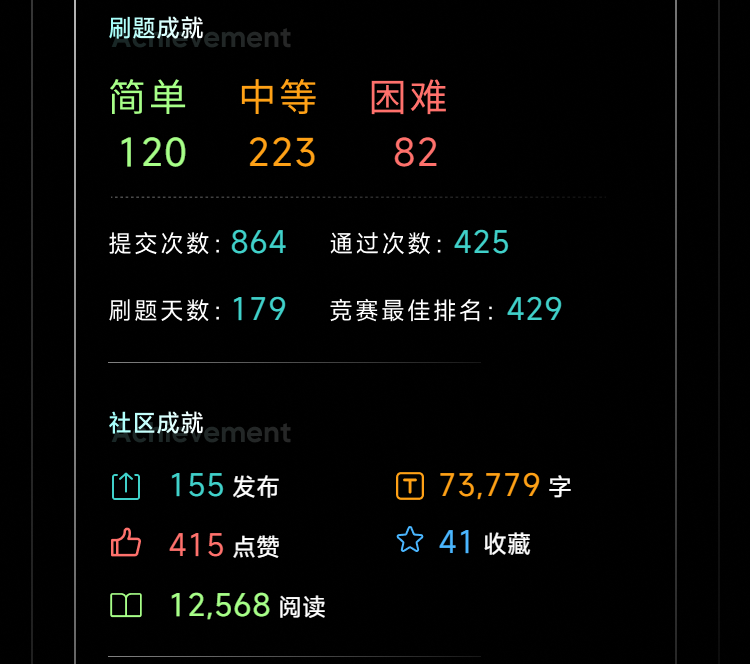

# leetcode

https://leetcode.cn/u/na-ge-shui-o/

mtj is short for matiji,which includes weekly contests' codes

pic includes some pictures for forum

writecode includes some codes for problems on leetcode.cn

build this to record my learning porcess on leetcode.cn, and be famililar with github.This is my first repository on github. 
--@tjujingzong

### 2022 小结如下



原本打算在2022结束前，写点东西，总结一下这一年在Leetcode上学到的点东西，结果被可视化这呆瓜课给耽误了，1.8之后，陆陆续续写点总结，包括课程的，还有Leetcode上以及别的一些心得与体会。

### 2023-9-8刷PAT有感

写递归时，能用全局变量就不要用传参的方式，容易超内存

map与unordered_map

内部实现： 这是最显著的区别。map 使用平衡二叉搜索树（通常是红黑树）来实现，这意味着元素在 map 中是有序的，根据键的大小排序。而 unordered_map 使用哈希表来实现，这使得元素在 unordered_map 中是无序的。

性能： 由于 map 使用平衡二叉搜索树，它的插入、查找和删除操作的平均时间复杂度是 O(log n)，其中 n 是元素的数量。而 unordered_map 使用哈希表，它的这些操作的平均时间复杂度是接近 O(1) 的，具体性能取决于哈希函数的质量以及负载因子。

尽可能使用unorder_map

### 9-10又学到一些
- map中元素的顺序是按照key升序排列
- `for(auto k:mp)`如果在循环中没有使用引用（没有&），那么会复制键的副本，这可能会导致速度变慢，尤其是在容器中存储的是大型对象（例如字符串）时。
- 指针初始化`node* root = new node;`

### 9-11
- `printf("Take Line#%d from %04d to %04d.\n", pre, st, en);` 可以控制输出为4位

### 9-12
例如，如果要输出 3.25，并保留一位小数，那么 printf 函数会在 3.2 和 3.3 之间选择一个值。由于 3.2 的偶数部分较大（即整数部分是偶数），所以 printf 函数会输出 3.2。这就是为什么您看到的输出是 3.25 3.2 而不是 3.25 3.3 的原因。
想输出3.3，加下面代码
```
double rounded_avg = round(avg * 10.0) / 10.0; 
```

### 2023-9-13 重温AVL树 感觉当时就没学明白

AVL树的英文全称是"Adelson-Velsky and Landis tree"，即"Adelson-Velsky 和 Landis 树"。这种树是以其发明者 Georgy Adelson-Velsky 和 Evgenii Landis 的名字命名的，他们在1962年首次提出了这一自平衡二叉搜索树的概念。

插入类型：

- LL插入（左子树的左子树插入）：当在AVL树的左子树的左子树中插入新节点时，可能会导致不平衡。解决方法是进行一次右旋转。

- LR插入（左子树的右子树插入）：当在AVL树的左子树的右子树中插入新节点时，可能会导致不平衡。解决方法是先进行一次左旋转，然后再进行一次右旋转。

- RR插入（右子树的右子树插入）：当在AVL树的右子树的右子树中插入新节点时，可能会导致不平衡。解决方法是进行一次左旋转。

- RL插入（右子树的左子树插入）：当在AVL树的右子树的左子树中插入新节点时，可能会导致不平衡。解决方法是先进行一次右旋转，然后再进行一次左旋转。


```
\\右旋操作
TreeNode* rightRotate(TreeNode* root) {
  TreeNode* newRoot = root->left;
  root->left = newRoot->right;
  newRoot->right = root;
  updateHeight(root);
  updateHeight(newRoot);
  return newRoot;
}
// 平衡维护
 if (balance > 1) {
    if (val < root->left->val) {
      return rightRotate(root);
    }
    if (val > root->left->val) {
      root->left = leftRotate(root->left);
      return rightRotate(root);
    }
  }
```


### 9-14 
二叉树假如给了前序遍历和后序遍历 怎么判断树是否唯一？？？？

在这个特定的树构建和判断唯一性的问题中，非叶子节点的左子树和右子树必须同时存在，才能保证树的唯一性。如果一个非叶子节点只有左子树或只有右子树，那么就无法通过给定的前序遍历和后序遍历序列唯一确定一棵二叉树
```
  root->left = buildTree(preorder, postorder, prel + 1, prel + left_size, postl,
                         left_root_idx);
  root->right = buildTree(preorder, postorder, prel + left_size + 1, prer,
                          left_root_idx + 1, postr - 1);

  if ((root->left && !root->right) || (!root->left && root->right)) {
    isUnique = false;
  }
```